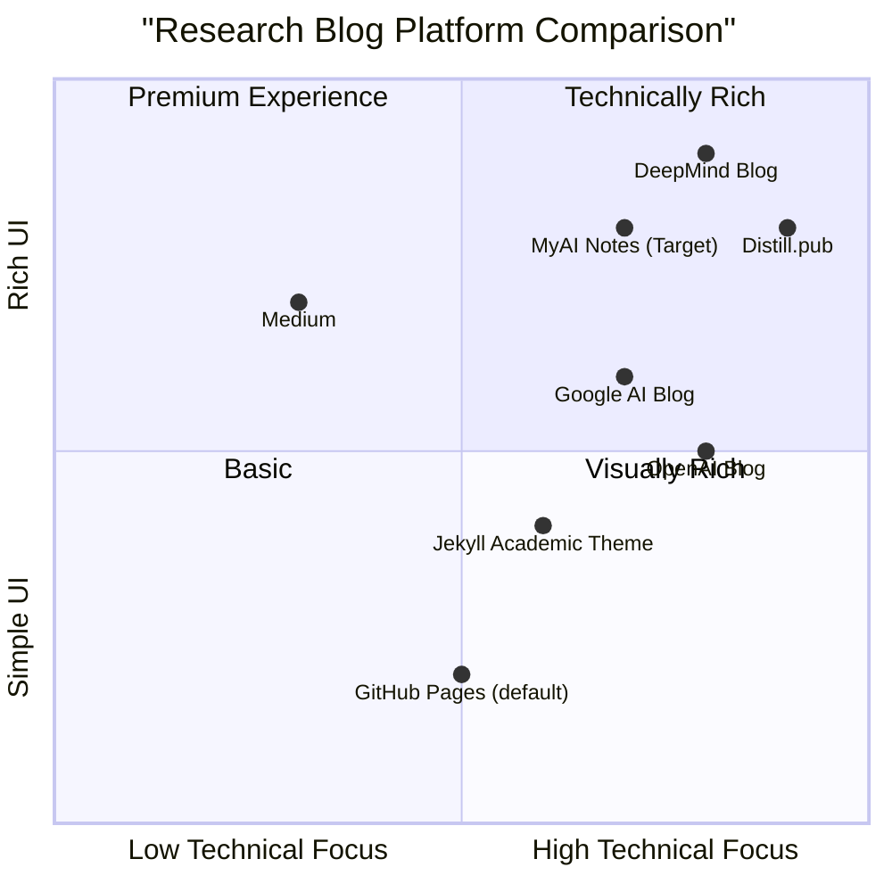

# Product Requirements Document (PRD): MyAI Notes Blog Platform

## Project Overview

We will create a GitHub Pages-hosted Jekyll blog named 'My ResearchNotes' that looks and feels inspired by DeepMind's public blog while maintaining original branding and styling. The platform will serve as a professional research notes blog with a clean, modern interface optimized for readability and content discovery.

This document outlines the requirements for building the blog platform, focusing on both user experience and technical implementation.

## Original Requirements

Create the full codebase for a GitHub Pages–hosted Jekyll blog named "My ResearchNotes". The site must look and feel inspired by DeepMind's public blog while remaining original in branding and styling.

The repository should follow a specific layout structure including configuration files, layouts, includes, assets, and sample content. The homepage and post page UX should follow specific design requirements with a hero section, category filters, article grid, and pagination. The style guide specifies color palette, typography, and accessibility requirements.

## Product Definition

### Product Goals

1. **Content-First Experience**: Create a blog platform that emphasizes research content with clean typography, optimal reading experience, and professional presentation.

2. **Effortless Content Discovery**: Implement intuitive category filtering and navigation that helps readers easily find and explore topics of interest.

3. **Developer-Friendly Implementation**: Ensure the codebase is well-organized, documented, and easy to extend or modify for developers using GitHub Pages and Jekyll.


### User Stories

1. **As a researcher**, I want to easily browse research articles by category so that I can find relevant information quickly.

2. **As a content creator**, I want a clean and professional publishing platform so that my research notes look polished and are easy to read.

3. **As a blog maintainer**, I want a straightforward GitHub Pages implementation so that I can focus on content rather than complex website maintenance.

4. **As a mobile reader**, I want a responsive design experience so that I can comfortably read research articles on any device.

5. **As a returning visitor**, I want to easily discover related content so that I can deepen my understanding of topics I'm interested in.

### Competitive Analysis

| Product | Pros | Cons |
|---------|------|------|
| DeepMind Blog | - Clean, professional design<br>- Clear typography<br>- Excellent content categorization<br>- Strong visual identity | - Complex custom implementation<br>- Not Jekyll-based<br>- Resource-intensive media elements |
| Distill.pub | - Academic focus<br>- Interactive visualizations<br>- Strong typography<br>- Clean reading experience | - Complex implementation<br>- Specialized for ML papers<br>- Limited customization options |
| GitHub Pages (default) | - Simple setup<br>- Free hosting<br>- Git-based workflow<br>- Jekyll compatibility | - Basic designs<br>- Limited dynamic features<br>- Minimal UX elements |
| Medium | - Clean reading experience<br>- Social engagement features<br>- Strong typography<br>- Mobile responsive | - Limited customization<br>- Platform lock-in<br>- Not self-hosted |
| Google AI Blog | - Clean design<br>- Technical content focus<br>- Good categorization<br>- Corporate backing | - Corporate constraints<br>- Limited personal branding<br>- Not open-source |
| OpenAI Blog | - Minimalist design<br>- Research focus<br>- Strong readability<br>- Technical depth | - Limited discovery features<br>- Minimal categorization<br>- Custom implementation |
| Jekyll Academic Theme | - Research-focused<br>- Jekyll compatible<br>- Open-source<br>- GitHub Pages ready | - Academic rather than blog focus<br>- Sometimes cluttered UX<br>- Limited visual appeal |

### Competitive Quadrant Chart



## Technical Specifications

### Requirements Analysis

The MyAI Notes blog platform will be built using Jekyll and hosted on GitHub Pages to ensure ease of maintenance and deployment. The platform must provide a professional research-focused reading experience with intuitive navigation while maintaining excellent performance and accessibility.

The implementation must follow the repository structure provided in the requirements, with specific attention to:

1. **Jekyll Configuration**: Ensuring GitHub Pages compatibility with the appropriate plugins and settings.

2. **Layout Structure**: Creating modular, reusable components for consistent design across the site.

3. **UX Implementation**: Developing the homepage and post page layouts according to the specified requirements.

4. **Styling**: Implementing the design system with attention to color palette, typography, and component styling.

5. **JavaScript Functionality**: Creating the necessary interactivity for category filtering and other dynamic elements.

6. **Content Structure**: Establishing the post format with appropriate front matter and sample content.

7. **Documentation**: Providing clear instructions for local development and deployment.


### Requirements Pool

#### P0 (Must-have)

1. **Repository Structure**
   - Must follow the specified directory layout
   - Must include all required files and directories
   - Must implement proper Jekyll configuration

2. **Homepage Implementation**
   - Must implement hero section with latest post's hero image
   - Must implement category filter bar with client-side filtering
   - Must implement responsive article grid with post cards
   - Must implement pagination

3. **Post Page Implementation**
   - Must implement full-bleed hero image with title and metadata
   - Must implement content column with proper typography
   - Must implement share buttons
   - Must implement "More in Category" section

4. **Styling**
   - Must follow specified color palette
   - Must implement specified typography
   - Must ensure AAA accessibility for text contrast
   - Must ensure all images have alt text

5. **Sample Content**
   - Must include at least 3 sample posts with required front matter
   - Must demonstrate different categories
   - Must include appropriate sample images

#### P1 (Should-have)

1. **Performance Optimization**
   - Should optimize images for web
   - Should minimize CSS and JavaScript
   - Should implement lazy loading for images

2. **Enhanced UX**
   - Should implement smooth transitions for category filtering
   - Should implement hover effects for interactive elements
   - Should implement responsive design for all screen sizes

3. **Documentation**
   - Should provide detailed README with setup and deployment instructions
   - Should include comments in code for maintainability

#### P2 (Nice-to-have)

1. **Additional Features**
   - May implement dark mode toggle
   - May implement estimated reading time
   - May implement search functionality

2. **SEO Optimization**
   - May implement additional meta tags
   - May implement JSON-LD structured data

### UI Design Draft

#### Homepage Layout

```
+---------------------------------------------+
|                 NAVBAR                      |
+---------------------------------------------+
|                                             |
|                                             |
|                  HERO                       |
|          (Latest Post Image)                |
|                                             |
|           Site Title + Tagline              |
|           [Read Article Button]             |
|                                             |
+---------------------------------------------+
|                                             |
| [All] [Research] [Opinion] [Tutorials] [News] |
|                                             |
+---------------------------------------------+
|                                             |
|   +--------+    +--------+    +--------+    |
|   |Category|    |Category|    |Category|    |
|   |        |    |        |    |        |    |
|   | Image  |    | Image  |    | Image  |    |
|   |        |    |        |    |        |    |
|   | Title  |    | Title  |    | Title  |    |
|   | Excerpt|    | Excerpt|    | Excerpt|    |
|   | Date   |    | Date   |    | Date   |    |
|   +--------+    +--------+    +--------+    |
|                                             |
|   +--------+    +--------+    +--------+    |
|   |Category|    |Category|    |Category|    |
|   |        |    |        |    |        |    |
|   | Image  |    | Image  |    | Image  |    |
|   |        |    |        |    |        |    |
|   | Title  |    | Title  |    | Title  |    |
|   | Excerpt|    | Excerpt|    | Excerpt|    |
|   | Date   |    | Date   |    | Date   |    |
|   +--------+    +--------+    +--------+    |
|                                             |
+---------------------------------------------+
|                                             |
|        [← Older]         [Newer →]          |
|                                             |
+---------------------------------------------+
|                 FOOTER                      |
+---------------------------------------------+
```

#### Post Page Layout

```
+---------------------------------------------+
|                 NAVBAR                      |
+---------------------------------------------+
|                                             |
|                                             |
|             FULL-BLEED HERO IMAGE           |
|                                             |
|                                             |
+---------------------------------------------+
|                                             |
|         TITLE (Large Sans-Serif)            |
|         Subheading                           |
|         Author List · Publish Date          |
|                                             |
|  [Share]                                    |
|  [Buttons] Post content, max-width 720px    |
|            with 18px font and line-height   |
|            of 1.6. Left-aligned text with   |
|            proper paragraph spacing and     |
|            formatting for headings, lists,  |
|            code blocks, and other elements. |
|                                             |
|                                             |
|                                             |
|         MORE IN <CATEGORY>                  |
|                                             |
|   +--------+    +--------+    +--------+    |
|   |Category|    |Category|    |Category|    |
|   | Image  |    | Image  |    | Image  |    |
|   | Title  |    | Title  |    | Title  |    |
|   +--------+    +--------+    +--------+    |
|                                             |
+---------------------------------------------+
|                 FOOTER                      |
+---------------------------------------------+
```

### Open Questions

1. **Content Strategy**
   - What is the primary focus of the research notes? (AI, Machine Learning, General Science, etc.)
   - How frequently will new content be published?
   - Will there be multiple authors or a single author?

2. **Branding Details**
   - Is there a specific logo or icon to be used?
   - Are there additional brand colors beyond those specified?
   - Should custom illustrations or stock imagery be used for post thumbnails?

3. **Additional Features**
   - Is there a need for comment functionality? (Disqus, GitHub Issues, etc.)
   - Should analytics tracking be implemented? (Google Analytics, Plausible, etc.)
   - Is there a need for a newsletter subscription option?

4. **Deployment Timeline**
   - When is the target launch date for the blog?
   - Will there be a phased approach to feature implementation?

## Implementation Timeline

1. **Phase 1: Core Structure Setup** (Week 1)
   - Repository setup
   - Jekyll configuration
   - Base layouts and includes
   - Initial styling

2. **Phase 2: Homepage Implementation** (Week 1-2)
   - Hero section
   - Category filter
   - Article grid
   - Pagination

3. **Phase 3: Post Page Implementation** (Week 2)
   - Post layout
   - Typography
   - Share buttons
   - Related posts

4. **Phase 4: Styling and Refinement** (Week 2-3)
   - Complete styling implementation
   - Responsive design
   - Accessibility testing
   - Performance optimization

5. **Phase 5: Content and Documentation** (Week 3)
   - Sample posts creation
   - Documentation
   - README
   - Final testing

## Conclusion

The MyAI Notes blog platform will provide a professional and visually appealing environment for publishing research notes. By following the DeepMind-inspired design principles while maintaining original branding, the platform will offer an excellent reading experience focused on content discoverability and readability. The implementation on GitHub Pages using Jekyll ensures ease of maintenance and deployment, making it an ideal solution for researchers and technical writers.


## Market Research

### Current Landscape of Academic and Research Blogs

The academic and research blog landscape has evolved significantly in recent years, with a focus on clean design, content discoverability, and mobile accessibility. Several platforms and frameworks have emerged as leaders in this space:

1. **Jekyll-Based Academic Solutions**
   - **Al-folio**: A popular Jekyll theme designed specifically for academics with 13,000+ GitHub stars
   - **Minimal Mistakes**: A versatile Jekyll theme with academic customization options (12,900+ stars)
   - **Just-the-Docs**: Excellence for research documentation with good search capabilities (8,200+ stars)
   - **Chirpy**: Modern Jekyll theme with excellent responsive design and built-in search (8,700+ stars)

2. **Research-Focused Publication Platforms**
   - **Distill.pub**: Interactive ML research publication platform
   - **OpenReview**: Academic peer-review and publication platform
   - **ArXiv/bioRxiv Blogs**: Extensions to traditional paper repositories

3. **Corporate Research Blogs**
   - **DeepMind Blog**: Clean, professional research communication
   - **Google AI Blog**: Technical content focus with strong readability
   - **OpenAI Blog**: Minimalist design with focus on research clarity
   - **Facebook/Meta AI Blog**: Visual-heavy research communication

### Key User Needs Identified

Based on current market trends and user behavior in academic and research blogging, we've identified several key user needs:

1. **Content Discoverability**
   - Effective categorization systems
   - Intuitive search functionality
   - Related content recommendations

2. **Professional Presentation**
   - Clean, distraction-free reading experience
   - Support for technical content (code blocks, equations)
   - Professional visual identity

3. **Mobile Accessibility**
   - Responsive design for all device sizes
   - Touch-friendly navigation
   - Optimized reading experience on small screens

4. **Performance**
   - Fast loading times
   - Minimal dependencies
   - Efficient image handling

5. **Content Management**
   - Easy publishing workflow using Markdown
   - Simple metadata management
   - Version control integration

### Design Trends in Research Blogs

Recent design trends in academic and research blogs include:

1. **Typography Focus**
   - Increased font sizes (18px body text becoming standard)
   - Higher contrast for readability
   - Clear typographic hierarchy

2. **Minimalist Layouts**
   - Reduced visual clutter
   - Focused reading experiences
   - Strategic use of whitespace

3. **Rich Media Integration**
   - Support for interactive visualizations
   - Video and animation embedding
   - High-quality imagery

4. **Accessibility Emphasis**
   - High contrast text
   - Alternative text for images
   - Keyboard navigation support

5. **Dark Mode Options**
   - Reduced eye strain for reading
   - Toggle between light and dark themes
   - System preference detection

## Implementation Recommendations

Based on our research and analysis, we recommend the following implementation approach for the MyAI Notes blog platform:

1. **Base Framework**
   - Use Jekyll with GitHub Pages for simple deployment and maintenance
   - Implement a custom theme inspired by DeepMind but with unique branding
   - Focus on performance optimization from the start

2. **Critical Features**
   - Implement robust category filtering for content discovery
   - Create a reading-optimized post layout with proper typography
   - Develop a responsive design that works well across all devices
   - Ensure accessibility compliance throughout the site

3. **Distinctive Elements**
   - Create a unique color scheme based on the specified palette
   - Implement clean, card-based content presentation
   - Add subtle animations for interactive elements
   - Develop a consistent visual language across the site

4. **Technical Considerations**
   - Use modern CSS features (Grid/Flexbox) for layouts
   - Implement JavaScript judiciously for interactive elements
   - Optimize images for web delivery
   - Leverage Jekyll's built-in features for pagination and collections

5. **Content Strategy**
   - Develop sample posts across different categories
   - Create guidelines for future content creation
   - Establish consistent metadata usage

## Next Steps

1. **Initial Setup**
   - Create repository structure according to requirements
   - Configure Jekyll and necessary plugins
   - Implement base layouts and includes

2. **Core Development**
   - Develop homepage components
   - Create post layout
   - Implement styling according to design guidelines

3. **Testing and Refinement**
   - Test across multiple devices and browsers
   - Optimize for performance
   - Address accessibility concerns

4. **Documentation and Launch**
   - Create comprehensive README
   - Develop sample content
   - Prepare for deployment

## Conclusion

The MyAI Notes blog platform presents an opportunity to create a modern, professional research blog with a focus on content discoverability and reading experience. By following the design principles inspired by DeepMind's blog while maintaining original branding, we can create a distinctive platform that serves as an excellent showcase for research content.

The technical implementation using Jekyll and GitHub Pages ensures ease of maintenance and deployment, making it accessible to researchers and content creators without requiring extensive technical knowledge. The modular architecture allows for future expansion and customization as needs evolve.

By prioritizing content readability, responsive design, and intuitive navigation, the platform will provide an excellent user experience for both content creators and readers, ultimately supporting the effective communication of research findings and ideas.
